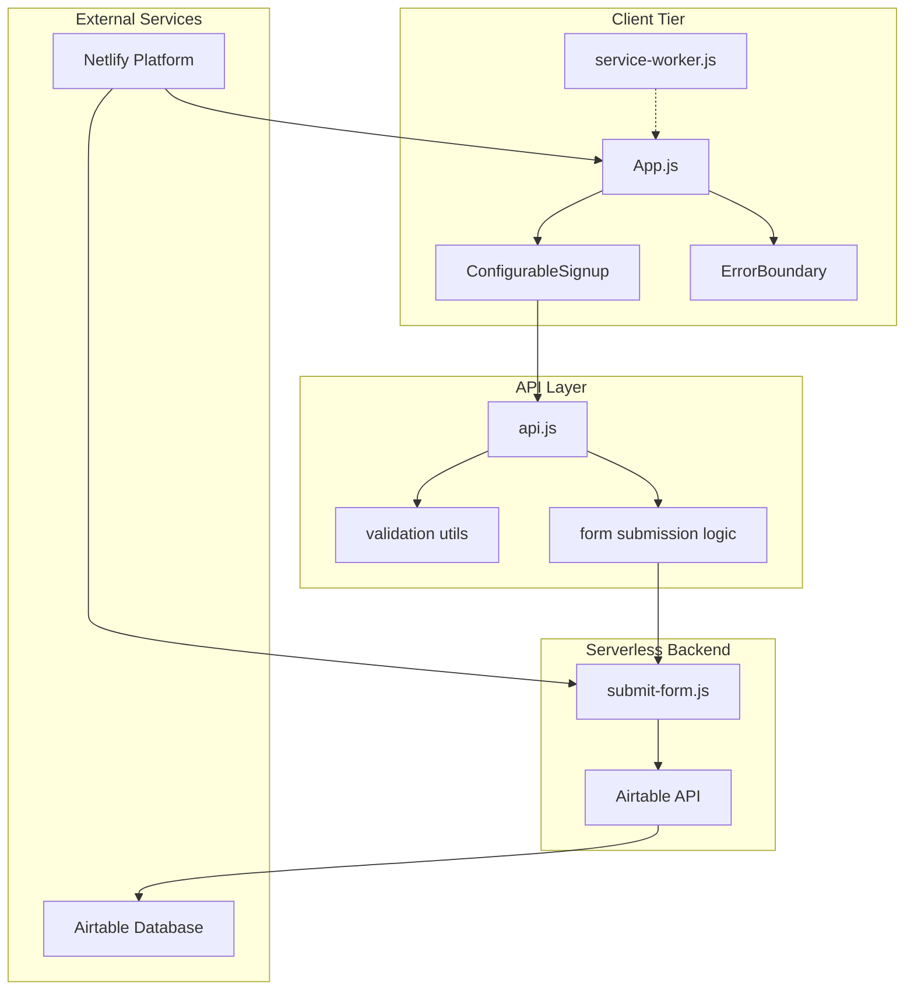
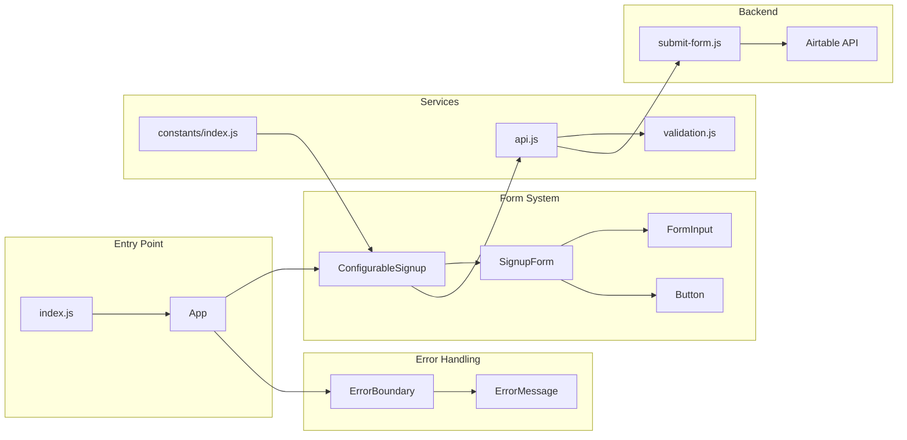

# Embodi Signup

This document provides a comprehensive overview of the `embodi-signup` repository, a React-based mailing list signup application designed for Embodi Computing. The system features a modern, responsive frontend with serverless backend integration for collecting user signups and storing them in Airtable.

## System Purpose and Scope
The `embodi-signup` application is a production-ready mailing list signup system that provides:
- **User Registration Interface**: Modern, responsive signup forms with validation 
- **Serverless Backend Processing**: Netlify Functions for form submission handling 
- **Data Persistence**: Airtable integration for storing user information 
- **Progressive Web App Features**: Service worker implementation for offline capabilities 
- **Comprehensive Testing**: Jest and React Testing Library integration 
- **Modern Development Workflow**: ESLint, Prettier, and automated build processes 

## Technology Stack
The application is built using modern web technologies organized in a three-tier architecture:

| Layer | Technology | Purpose |
|---|---|---|
| Frontend | React 19.1.0 | User interface and interaction |
| Styling | Tailwind CSS | Responsive design system |
| Backend | Netlify Functions | Serverless form processing |
| Database | Airtable | User data storage |
| Testing | Jest + React Testing Library | Automated testing |
| Build | react-scripts | Development and build tooling |
| Hosting | Netlify | Static site hosting and deployment |

## System Architecture Overview
The `embodi-signup` system follows a serverless architecture pattern with clear separation of concerns:



## Core Components and Code Organization
The application is structured around key React components and services that handle different aspects of the signup process:



## Data Flow and Form Processing
The application implements a comprehensive data flow from user input to persistent storage:

### Form Submission Pipeline
1. **User Input**: Users interact with form fields in `ConfigurableSignup` component 
2. **Client Validation**: Form data is validated using client-side validation utilities 
3. **API Service**: The `api.js` service handles form submission logic 
4. **Environment Detection**: System determines if running in development or production 
5. **Backend Processing**: Netlify Functions process the form data 
6. **Data Storage**: Validated data is stored in Airtable via API integration 

### Key Form Fields
The signup form captures the following user information:

| Field | Type | Validation | Required |
|---|---|---|---|
| Email | Email | Valid email format | Yes |
| Name | Text | Non-empty string | No |
| Phone | Text | Optional formatting | No |
| Timestamp | Auto-generated | ISO timestamp | Auto |

## Development and Build Workflow
The application includes a comprehensive development workflow with multiple automation tools:

### Available Scripts
The project provides several npm scripts for different development phases:

```bash
# Development
npm start          # Start React development server
npm run dev        # Start Netlify development environment
npm run dev:react  # Start React-only development

# Testing
npm test           # Run tests in watch mode
npm run test:watch # Run tests with watch mode
npm run test:coverage # Generate test coverage report

# Code Quality
npm run lint       # Run ESLint
npm run lint:fix   # Fix ESLint issues automatically
npm run format     # Format code with Prettier
npm run format:check # Check code formatting

# Build and Deploy
npm run build      # Create production build
npm run audit      # Run security audit
```

## Progressive Web App Features
The application implements PWA capabilities through service worker integration:

### Service Worker Functionality
- **Precaching**: Static assets are precached for offline access 
- **App Shell Architecture**: Navigation requests are fulfilled with cached `index.html` 
- **Runtime Caching**: Dynamic content caching with stale-while-revalidate strategy 
- **Background Sync**: Offline form submission capabilities 
- **Cache Management**: Automatic cache cleanup and expiration 

## Environment Configuration
The application supports flexible environment configuration for different deployment contexts:

### Required Environment Variables
```bash
# Airtable Configuration
AIRTABLE_PERSONAL_ACCESS_TOKEN=your_token_here
AIRTABLE_BASE_ID=your_base_id_here
AIRTABLE_TABLE_NAME=your_table_name_here

# Frontend Configuration
REACT_APP_FORM_ENDPOINT=/.netlify/functions/submit-form
```

## Production Deployment
The application is designed for deployment on Netlify with the following configuration:
- **Build Command**: `npm run build` 
- **Publish Directory**: `build` 
- **Functions Directory**: `netlify/functions` 
- **Environment Variables**: Configured in Netlify dashboard 

The system is currently production-ready with comprehensive testing coverage and automated deployment pipeline.